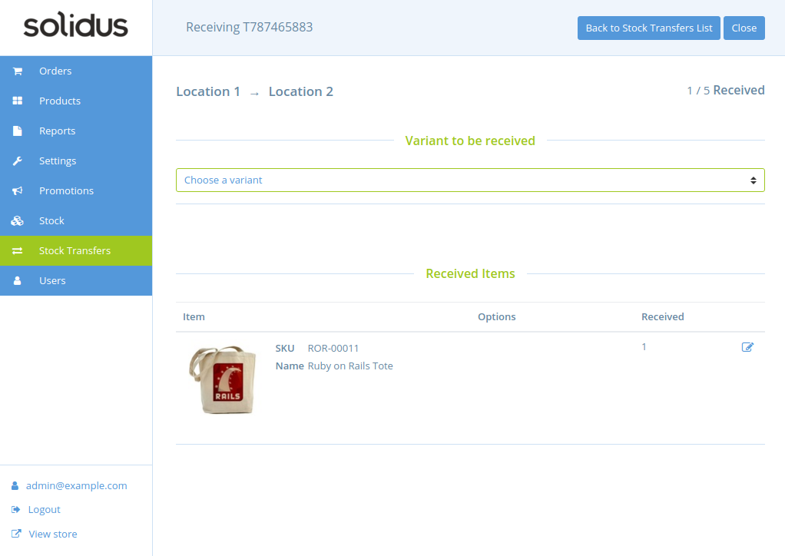

[](https://travis-ci.org/solidusio-contrib/solidus_stock_transfers)

> _This extension provides the stock transfers interface which was extracted
> from Solidus 2.5 due to not being widely used and (as a result) not receiving
> the improvements it needs._
>
> _This should work but will not receive further improvements from the Solidus
> core team. If you are interested in improving and maintaining it, get in
> contact with us in slack._

Solidus Stock Transfers
=======================

This extension provides an admin interface to transfer stock between two
locations. For most users, even with multiple stock locations, this extension
isn't necessary, and setting the stock levels manually will be sufficient.

This interface requires jumping through some hoops and an unpleasant interface
in order to be strict about and have a record of the transfer occurring.



Installation
------------

Add solidus_stock_transfers to your Gemfile:

```ruby
gem 'solidus_stock_transfers'
```

Bundle your dependencies and run the installation generator:

```shell
bundle
bundle exec rails g solidus_stock_transfers:install
```

Testing
-------

First bundle your dependencies, then run `rake`. `rake` will default to building the dummy app if it does not exist, then it will run specs, and [Rubocop](https://github.com/bbatsov/rubocop) static code analysis. The dummy app can be regenerated by using `rake test_app`.

```shell
bundle
bundle exec rake
```

When testing your application's integration with this extension you may use its factories.
Simply add this require statement to your spec_helper:

```ruby
require 'solidus_stock_transfers/factories'
```

Copyright (c) 2017 Solidus contributors, released under the New BSD License
